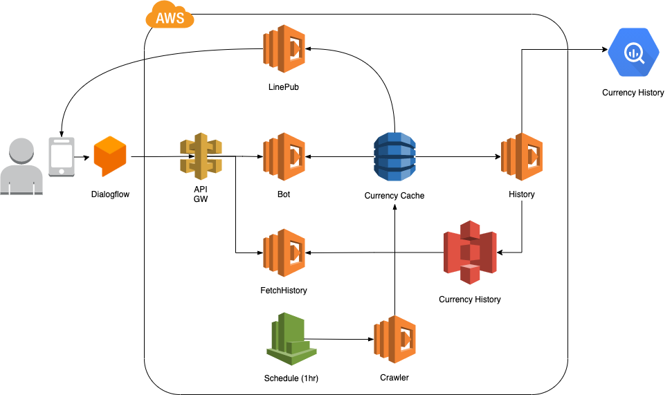

# ExchangeCrawler

[](https://gitlab.com/AI003TeamWork/CloudProject/ExchangeCrawler/commits/master)
[](https://gitlab.com/AI003TeamWork/CloudProject/ExchangeCrawler/commits/master)

## Architecture



## Usage

Install all dependency library:

```bash
npm install
```

Run unit test:

```bash
npm test
```

Setup LINE access token/secret key:

```bash
aws ssm put-parameter --type=String --name /exchangecrawler/LINE_ACCESSTOKEN --value **YOUR ACCESS TOKEN**
aws ssm put-parameter --type=String --name /exchangecrawler/LINE_SECRET --value **YOUR SECRET**
```

Deploy ExchangeCrawler service to AWS:

```bash
sls deploy
```
